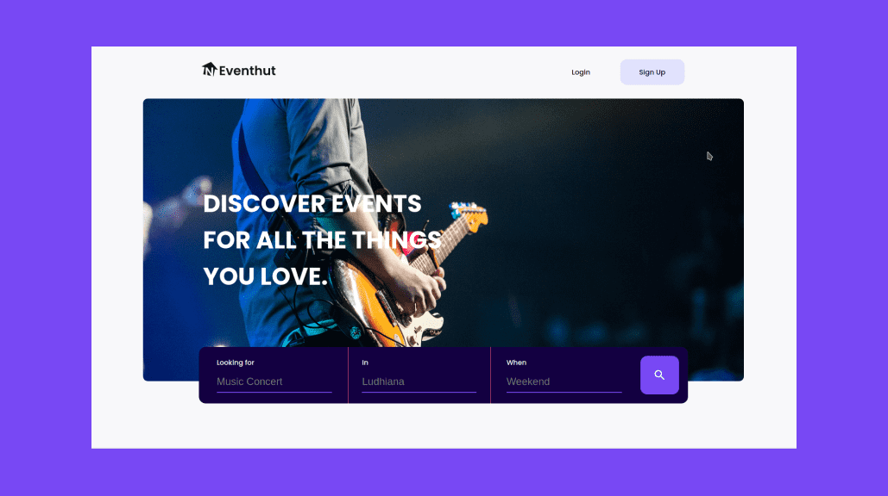

# Eventhut

Eventhut is a platform that connects you to events. Users can discover and book slot for their favorite events using this web application.

Check out the live demo: https://eventhut.vercel.app/

This app is build using Nextjs, Strapi, Magic link and Stripe

## How to run the project?

1. Clone this repository in your local system.
2. Rename `.env.example` to `.env_local` and add your credentials.
3. Open the command prompt from your project directory and run the command `npm install && npm run dev`.
4. Go to your browser and type `http://localhost:3000/` in the address bar.
5. Hurray! That's it.
